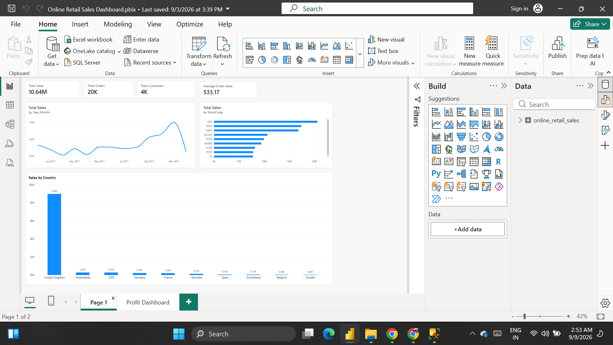
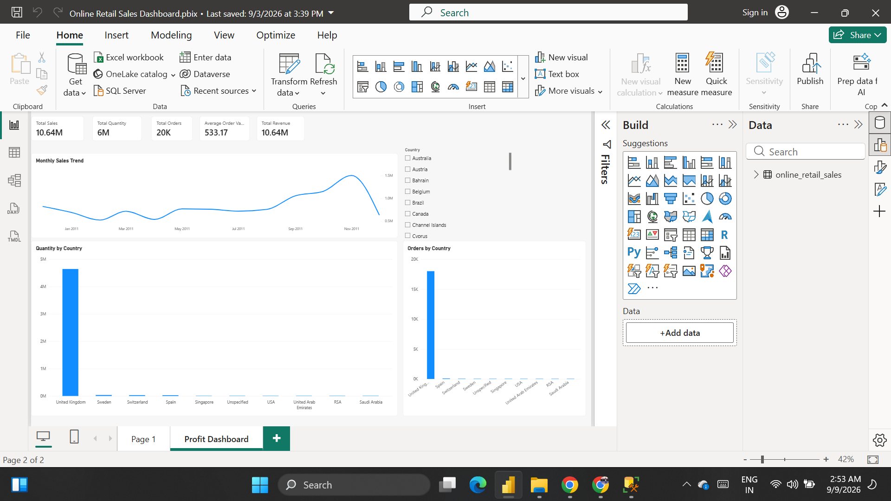

# E-commerce Sales & Revenue Analysis Dashboard

An end-to-end e-commerce analytics project using **SQL, Excel and Power BI** to analyze sales performance, customers, products and countries.

## 📌 Project Overview

This project analyzes real-world transactional data from an online retailer. The analysis covers sales trends, customer behavior, product performance and geographic sales distribution.

The project demonstrates the complete analytics workflow:

**Data Cleaning → SQL Analysis → Power BI Dashboard → Business Insights**

## 🛠️ Tools & Technologies

- **SQL Server** – Data analysis and business queries
- **Microsoft Excel** – Data preparation and validation
- **Power BI** – Interactive dashboard and visualization
- **GitHub** – Project documentation and version control

## 📊 Key KPIs

| KPI | Value |
|---|---:|
| Total Sales | £10.64M |
| Total Orders | 19,960 |
| Total Customers | 4,338 |
| Average Order Value | £533.17 |

#Raw DATA SET
The project uses the **[UCI Online Retail Dataset](https://archive.ics.uci.edu/dataset/352/online+retail)**, containing real transactional data from a UK-based online retailer.

## 🔍 SQL Analysis

The SQL analysis includes:

- Data quality checks
- Country-wise sales analysis
- Monthly sales trends
- Top products by quantity and revenue
- Top customers by revenue
- Average Order Value (AOV)
- One-time vs repeat customers
- RFM-based customer segmentation

## 📈 Power BI Dashboard

### Sales Dashboard

### Revenue Dashboard

## 💡 Business Insights

- The business generated more than **£10.6M in sales** across approximately **20K orders**.
- Customer analysis identifies both one-time and repeat purchasing behavior.
- Product-level analysis highlights the products contributing most to sales and quantity.
- Country-level analysis helps identify the strongest geographic markets.
- RFM segmentation can be used to identify valuable customer groups and support targeted marketing strategies.

## 📁 Project Files

- [`ecommerce_analysis.sql`](ecommerce_analysis.sql) – SQL analysis queries
- [`Ecommerce_Sales_Profit_Dashboard.pbix`](Ecommerce_Sales_Profit_Dashboard.pbix) – Power BI dashboard
- [`Analysis.png`](Analysis.png) – Sales dashboard screenshot
- [`Revenue_Dashboard.png`](Revenue_Dashboard.png) – Revenue dashboard screenshot

## 📂 Dataset

The project uses the **UCI Online Retail Dataset**, containing real transactional data from a UK-based online retailer.

The dataset covers transactions from **December 2010 to December 2011**.

> Note: The dataset does not contain product cost/COGS data. Therefore, actual profit and profit margin are not calculated. The dashboard focuses on sales and revenue performance.

## 🎯 Skills Demonstrated

**SQL | Data Cleaning | Data Analysis | Power BI | DAX | Data Visualization | Customer Segmentation | Business Intelligence**
